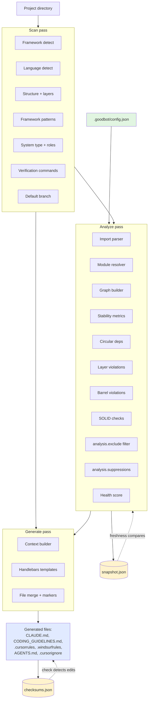

# goodbot Architecture

High-level map of how goodbot turns a project directory into AI agent guardrail files — and how it detects when those guardrails drift from reality.

## Overview

Goodbot is a pipeline that runs three passes over a project:

1. **Scan** — detect framework, language, architectural layers, verification commands, system type, framework-specific conventions.
2. **Analyze** — parse every import, build the module dependency graph, compute stability, check SOLID principles, grade overall health.
3. **Generate** — render Handlebars templates using the detected facts plus analysis insights, producing `CLAUDE.md`, `CODING_GUIDELINES.md`, `.cursorrules`, etc.

Between passes, goodbot persists three small state files under `.goodbot/`:

- `config.json` — single source of truth for team rules (committed)
- `snapshot.json` — analysis baseline for drift detection (gitignored)
- `checksums.json` — hashes of generated files for manual-edit detection (gitignored)

## Data flow

### How commands fit in

| Command | Runs which passes |
|---------|-------------------|
| `scan` | Scan only — fast reconnaissance |
| `analyze` | Scan + Analyze — architectural audit |
| `init` | Scan → build/merge config |
| `generate` | Scan + (Analyze on first run, or from snapshot) + Generate |
| `check` | Read checksums + optionally re-run Analyze with `--strict` |
| `freshness` | Scan + Analyze, compare vs `snapshot.json` |
| `suppress` / `unsuppress` | Scan + Analyze (no-ignore) + config write |

## Subsystems

### `src/config/`

The schema, migration layer, presets, and merge logic.

- `schema.ts` — Zod schema for `.goodbot/config.json`. Canonical shape lives here.
- `migrate.ts` — Rewrites legacy config keys on load (top-level `ignore` → `output.cursorignore`; `analysis.ignore` → `analysis.exclude`; plural keys → singular). Returns deprecation warnings for the caller to surface.
- `presets.ts` — `strict`/`recommended`/`relaxed` preset builders; framework-specific default analysis exclusions (e.g. TypeORM entity cycles).
- `defaults.ts` — Per-framework red flags, business-logic layer descriptions, and SOLID examples. The data-driven core: adding a new framework means adding one entry here, no template changes.
- `merge.ts` — When `init` runs on an existing config, merges the preset with the existing one — refreshes only scan-detected fields, preserves user customizations.

### `src/scanners/`

Everything that runs before `node_modules` is parsed — cheap inspections of the project.

- `framework.ts` — React / NestJS / Next / Vue / etc detection from `package.json` / `go.mod` / `requirements.txt`.
- `language.ts` — TypeScript / JavaScript / Python / Go.
- `structure.ts` — Walks `src/` (or `src/app/` for Angular, project root for Nuxt) and maps each directory to a canonical role.
- `roles.ts` — The Stable Dependency Principle ordering. Per system type (`api`/`ui`/`mixed`/`library`) defines canonical layer roles with stability levels. Directory names + file patterns (`*.controller.ts`, `*.entity.ts`) → roles.
- `patterns.ts` — Framework-specific convention detection (NestJS decorators, React state libraries, etc.). Surfaces as auto-detected notes in the generated guidelines.
- `verification.ts` — Reads `package.json` scripts to find the real `typecheck`/`lint`/`test`/`build` commands.
- `index.ts` — Orchestrates the scanners in parallel; also detects the default branch via `git symbolic-ref` → `git ls-remote` → commit-count heuristic.

### `src/analyzers/`

The heavy pipeline — this is where goodbot earns its health grade.

- `import-parser.ts` + `module-resolver.ts` — Parse every `.ts`/`.tsx`/`.js` file, resolve relative imports to their module.
- `graph-builder.ts` — Build the module dependency graph.
- `stability.ts` — Compute afferent (Ca), efferent (Ce), and instability (I = Ce / Ca+Ce). Detect SDP violations (stable modules depending on unstable ones).
- `cycles.ts` — Tarjan's strongly-connected-components algorithm for circular dependencies.
- `layer-checker.ts` — Flags upward dependencies against the system-type stability ordering. Annotates violations with role names.
- `barrel-checker.ts` — Detects imports that bypass a module's barrel (`index.ts`).
- Specialized checkers — `srp-checker.ts`, `isp-checker.ts`, `dip-checker.ts`, `complexity-checker.ts`, `duplication-checker.ts`, `dead-export-checker.ts`, `god-module-checker.ts`, `shallow-module-checker.ts`, `passthrough-checker.ts`.
- `custom-rules.ts` — User-defined import rules (`forbiddenIn`, `requiredIn`, `maxImports`).
- `analysis-ignore.ts` — Category-scoped filter (pattern → entire category suppressed). Maps to `config.analysis.exclude.*`.
- `suppressions.ts` — Per-violation filter (exact file or cycle → one violation suppressed). Tracks which suppression entries matched which violations so the orphan check can detect stale entries.
- `solid.ts` — Runs SRP/DIP/ISP checks and builds per-principle scores.
- `health-score.ts` — Weighted composite: dependencies (30%), stability (20%), SOLID (25%), architecture (25%). Ranks the top contributors to score loss.
- `ignore.ts` — Legacy `.goodbot/ignore` file support (file-level, all-checks suppression).
- `git-history.ts` + `temporal-coupling.ts` — Git-log-based hotspot detection and co-change analysis.

### `src/generators/`

Turns the facts into files.

- `context-builder.ts` — Shapes the scan + analysis data into the `GeneratorContext` the templates consume. This is where framework-specific layer descriptions and SOLID examples get injected (from `config/defaults.ts`) so templates don't need framework-branching logic.
- `template-engine.ts` — Handlebars setup, partial discovery, helper registration.
- `index.ts` — Iterates `FILE_MAP`, renders each enabled template, returns the file bundle with `mergeWithExisting` flags.
- `mermaid.ts` — Generates the optional `architecture.md` dependency graph.

### `src/templates/`

Handlebars templates. Partials live in `partials/`.

- `CODING_GUIDELINES.md.hbs` — The source of truth. All other agent files point to it.
- `CLAUDE.md.hbs`, `cursorrules.hbs`, `windsurfrules.hbs`, `AGENTS.md.hbs` — Agent-specific quick-refs.
- `cursorignore.hbs` — Cursor-specific output-ignore list.
- `partials/solid-principles.hbs`, `partials/design-principles.hbs`, `partials/business-logic-placement.hbs`, `partials/import-rules.hbs`, `partials/architecture-rules.hbs`, `partials/verification-checklist.hbs`

Templates are **data-driven** — no framework branching (`{{#if isNode}}` etc). Framework-specific content flows in through the `GeneratorContext` populated from `config/defaults.ts`. Adding a new framework requires a data entry, not a template edit.

### `src/commands/`

Thin CLI wrappers. Each command composes config loading + scan + analyze + generate in a different shape.

The non-trivial ones:
- `generate.ts` — Dispatches `decideFileWrite()` per file (from `file-write-decision.ts`), which applies the user's chosen `existingFileStrategy` (merge/overwrite/skip) and handles the `<!-- goodbot:start/end -->` marker contract for safe re-runs.
- `suppress.ts` / `unsuppress.ts` — Content-based stable IDs (e.g. `cycle-app-database`, `layer-src-scripts-migrate`). Add requires `--reason`; remove validates the ID still maps to a real suppression.
- `hooks.ts` — Installs into `.husky/` (detects husky v9's `core.hooksPath=.husky/_` convention and shifts to the user-facing parent), survives husky reinstalls.

### `src/freshness/`

- `snapshot.ts` — Serializes `AnalysisInsights` (health + violation counts + hotspots) to `snapshot.json`. Also provides `snapshotToInsights()` to rehydrate for quick regens.
- `compare.ts` — Compares a stored snapshot to a fresh analysis, producing `fresh` / `stale` / `degraded` / `improved` claims per field.

### `src/utils/`

File I/O helpers, logger, content-hashing.

## Key design decisions

### Why data-driven templates

Early versions branched in templates with `{{#if isNode}}` — a controllers line for backends, a screens line for frontends. This broke for Vue (UI with unique composables), NestJS (API with guards/interceptors), Next.js (mixed). Now templates only iterate arrays. Framework-specific content lives in `config/defaults.ts` and `src/scanners/roles.ts` as pure data. Adding a new framework is a single data entry.

### Why content-based suppression IDs

Positional IDs (`c0`, `l2`) shifted as new violations appeared. A CI script pinning `c0` could suppress the wrong cycle tomorrow. Content-based IDs (`cycle-app-database`, `layer-src-scripts-migrate`) are invariant while the violation exists and disappear when it's fixed. Paired with the orphan warning (`goodbot check --strict`), stale suppressions fail CI instead of silently persisting.

### Why markers instead of checksum-only

`CLAUDE.md` is often pre-existing — goodbot prepends its content between `<!-- goodbot:start -->` / `<!-- goodbot:end -->` markers, preserving the user's content below. This is the contract: "goodbot owns the marker section, user owns the rest." Checksums alone couldn't distinguish "goodbot overwrote the file" from "user wrote this file"; markers make the boundary explicit and survive `.goodbot/` deletion.

### Why a snapshot + diff instead of live comparison

`goodbot analyze` is an instant report ("your code right now is a B+"). But teams want "did my PR make things worse?" The snapshot captures a baseline; `freshness` and `diff` compare against it. This makes drift detectable without running analysis twice (before/after) — the snapshot *is* the "before." Fast regens (`generate` without `--analyze`) reuse the snapshot to render the health block in CLAUDE.md.

## Extension points

| Extend... | By editing... |
|-----------|---------------|
| Add a new framework | `src/config/defaults.ts` (red flags, SOLID examples) + `src/scanners/roles.ts` (if it has unique canonical layers) |
| Add a new architectural check | `src/analyzers/<name>-checker.ts`, wire into `src/analyzers/solid.ts` or `src/analyzers/index.ts` |
| Add a new generated file | `src/templates/<name>.hbs` + entry in `src/generators/index.ts` `FILE_MAP` |
| Add a new suppression rule | `src/config/schema.ts` `SuppressionRule` enum + `src/analyzers/suppressions.ts` category filter + `src/commands/suppress.ts` ID prefix |
| Add a system type | `src/scanners/roles.ts` (`SystemType` + `ROLES_BY_SYSTEM_TYPE`) + `detectSystemType()` mapping |

## Testing

`vitest` runs 293 unit tests across every analyzer, the config merge/migration logic, the suppression filter + ID generation, and the scanner role detection. No integration test harness — end-to-end verification is done manually against mock projects for each release.
