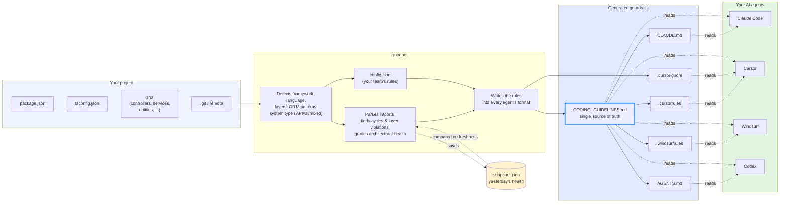

# How goodbot Works

A plain-English walkthrough of what goodbot actually does when you run it. If you want to know how the codebase is structured internally, see [ARCHITECTURE.md](./ARCHITECTURE.md) instead.

## The one-sentence version

Goodbot reads your project, figures out what kind of codebase it is and what rules it already follows, and writes those rules down in formats that every AI coding agent (Claude, Cursor, Windsurf, Codex, Copilot) can read — and tells you when your code starts drifting from what the rules claim.

## The picture



## What goodbot reads from your project

When you run `goodbot init` or `goodbot generate`, it looks at four things:

**1. Your manifest files.** `package.json` tells it the framework (NestJS if `@nestjs/core` is a dep, React if `react`, Vue if `vue`, etc.) and the real verification commands (`npm run typecheck`, `npm run lint`). `tsconfig.json` tells it the TypeScript setup. `requirements.txt` / `go.mod` cover Python and Go.

**2. Your directory structure.** Directories like `controllers/`, `services/`, `repositories/`, `entities/`, `components/`, `hooks/`, `screens/` get matched to canonical architectural roles. A NestJS project with `src/{controllers,services,entities}/` gets classified as an **API** with the standard stability ordering (domain → repositories → services → controllers). A React project with `src/{components,hooks,screens}/` becomes a **UI** with its own ordering. Unknown directories fall through to a generic "feature" role.

**3. Your imports.** Every `.ts` / `.tsx` / `.js` file in `src/` gets parsed. Goodbot builds the module dependency graph: who imports what, who depends on whom, what cycles exist, what violates your declared layer ordering.

**4. Your git state.** `git symbolic-ref refs/remotes/origin/HEAD` → `git ls-remote origin HEAD` → which well-known branch (`main`, `master`, `development`, `develop`) has the most commits. Goodbot uses this to fill in `conventions.mainBranch` — so your CODING_GUIDELINES.md tells agents to base PRs against the right branch.

## What goodbot writes

Six files, all generated from **one source of truth**:

```
CODING_GUIDELINES.md
     ↑
     │ all the others point to this
     │
  CLAUDE.md  .cursorrules  .windsurfrules  AGENTS.md  .cursorignore
```

**`CODING_GUIDELINES.md`** is the authoritative file. It contains:
- Your architecture diagram (layers + stability ordering)
- Import rules ("always import from barrel files", etc.)
- Where business logic belongs vs where it doesn't
- SOLID principles framed for your specific framework (a NestJS project gets examples about controllers + services; a React project gets examples about components + hooks)
- Design principles that counteract common AI-generated-code failure modes (deep modules, no speculative complexity)
- Auto-detected framework conventions (NestJS `*.module.ts` / `*.controller.ts` patterns, etc.)
- Current health grade + top issues to avoid making worse
- Your verification checklist

The other files — `CLAUDE.md`, `.cursorrules`, `.windsurfrules`, `AGENTS.md` — are tiny. They exist because each AI agent reads a different filename, but they all say the same thing: "Before writing code, read `CODING_GUIDELINES.md`." This eliminates the "my CLAUDE.md says one thing, my .cursorrules says another" drift problem.

`.cursorignore` is Cursor-specific — it tells Cursor which paths not to feed into its context (build artifacts, secrets, dependencies).

## How the rules get personalized

Goodbot doesn't use generic templates. The content of `CODING_GUIDELINES.md` is shaped by what it found:

- **Detected your framework is NestJS?** The "Business Logic Placement" table shows `controllers → request handling only` / `guards → authorization` / `services → business logic`. SOLID examples use controllers and services as the concrete case. Red flags mention "business logic in controllers" and "missing DTOs."
- **Detected your framework is React?** The same table shows `components → UI rendering` / `hooks → reusable state` / `services → API calls`. Red flags mention "direct fetch in components."
- **Detected a big circular-dep count from TypeORM entities?** The default `analysis.exclude.circularDep` pattern ignores `**/entities/**`, so the cycle count in your health grade isn't inflated by ORM relationships that are fine at runtime.
- **Detected 12 oversized files?** The "Known Issues" section lists them by name, so AI agents know which files to handle with care.

The analysis results become *data* the agent files consume. No generic boilerplate.

## How drift detection works

This is goodbot's main trick. Every time you run `goodbot generate` with `--analyze` (default on first run), it saves a snapshot to `.goodbot/snapshot.json`:

```
{
  "generatedAt": "...",
  "healthGrade": "A",
  "circularDeps": 0,
  "layerViolations": 0,
  "oversizedFiles": []
}
```

That snapshot represents **what your guardrails claim is true about the codebase**.

Two weeks later, you run `goodbot freshness`. It re-analyzes and compares:

```
Health grade             A → B+    ⚠ stale
Circular dependencies    0 → 2     ✗ degraded (+2)
Dead exports             0 → 3     ✗ degraded (+3)
Barrel violations        5 → 3     ↑ improved (-2)

✗ Your guardrails are stale. Run `goodbot generate --analyze --force` to update.
```

Now you know exactly what's drifted. Exit code is 1 if anything's degraded — so you can put this in CI and catch architectural debt the moment it merges.

## What state is kept

Everything lives in a tiny `.goodbot/` folder:

| File | Purpose | Commit it? |
|------|---------|-----------|
| `config.json` | Your team's rules — framework, layers, custom conventions, suppressions. This is the file you edit. | **Yes** |
| `snapshot.json` | "Here's what was true when guardrails were last generated." Powers `freshness`. | **No** (gitignored) |
| `checksums.json` | Hashes of generated files. Powers `check` — detects if someone hand-edited a generated file. | **No** (gitignored) |
| `history.json` | Optional health-grade history over time (populated by `trend`). | **No** (gitignored) |
| `.gitignore` | Auto-created on first run. Excludes the three files above. | **Yes** |

Split by intent:
- `config.json` is a **team artifact** — shared, reviewed, argued over.
- The rest is **local analysis state** — reproducible from the codebase + config.

## When things change: what each command does

| You want to... | Run |
|----------------|-----|
| Set goodbot up on a new project | `goodbot init` (interactive) or `goodbot init --preset recommended` (CI-safe) |
| Create/refresh the generated files | `goodbot generate` (first run analyzes; subsequent runs reuse cached snapshot for speed; add `--analyze` to refresh) |
| Pick up a new framework version / new directory | `goodbot init --preset recommended` (merges — preserves your custom rules, refreshes scan-detected fields) |
| See if files have drifted from what was last generated | `goodbot check` (fast; add `--strict` to also fail on stale suppressions) |
| See if your codebase has drifted from what guardrails claim | `goodbot freshness` |
| See what changed in this PR | `goodbot diff --base main` (or `--freshness` for snapshot comparison) |
| Get the health grade | `goodbot analyze` (full report) or `goodbot score` (one line) |
| Accept a real violation intentionally | `goodbot suppress <id> --reason "..." --apply` |
| Reverse an intentional acceptance | `goodbot unsuppress <id>` |

## The two kinds of "safe re-run" you should know about

**Config re-run** (`goodbot init --preset recommended` on an existing project):
- Refreshes scan-detected fields (framework, layers, system type)
- **Preserves everything you've hand-edited** (verification commands with custom flags, custom rules, suppressions, thresholds, budgets)
- Prints a diff of what changed before saving
- `--force` bypasses the merge and does a full reset

**File re-run** (`goodbot generate` when `CLAUDE.md` already exists):
- Goodbot wraps its content in `<!-- goodbot:start -->` / `<!-- goodbot:end -->` markers
- On first encounter, it **prepends** the goodbot section to your existing file — your content below is preserved
- On subsequent runs, it **replaces only the marker section** — everything outside the markers stays exactly where you put it
- This means it's safe to have your team's own notes in `CLAUDE.md` alongside goodbot's generated content

## Where the health grade comes from

`Health Grade: B+ (80/100)` is a weighted composite of four dimensions:

| Dimension | Weight | What it measures |
|-----------|--------|------------------|
| Dependencies | 30% | Circular deps, layer violations, barrel violations |
| Stability | 20% | Modules depending on things less stable than themselves |
| SOLID | 25% | File size, mixed concerns, fat interfaces |
| Architecture | 25% | Module count, coupling density, whether layers are well-defined |

Grades land on a standard A+/A/B+/B/C+/C/D/F scale:

```
A+  95–100  Exceptional
A   85–94   Clean, well-structured
B+  78–84   Good with minor issues
B   70–77   Solid, some room
C+  63–69   Notable debt
C   55–62   Significant issues
D   40–54   Major problems
F   0–39    Architectural emergency
```

The "Biggest issues" list under the grade tells you which specific things are costing points — so if you're at `B+ (80)` and "12 oversized files" is dragging you down, you know where to start.

## What's the point, though?

The bet goodbot is making: **AI coding agents will ship most production code within a few years, and they need persistent, enforceable, project-specific rules to do that well.** Without them, every PR is a coin flip on whether the agent understood your architecture. With them, the agent reads the same rules every session — no context loss, no cross-agent drift, no "but Claude said I could do it this way."

And because the rules are generated from your actual codebase (not a generic template), they stay accurate. When the code drifts from the rules, `freshness` tells you. When a team member hand-edits a generated file, `check` flags it. When someone commits a suppression that no longer matches any violation, `check --strict` fails CI.

It's guardrails as code — version-controlled, testable, enforceable.
